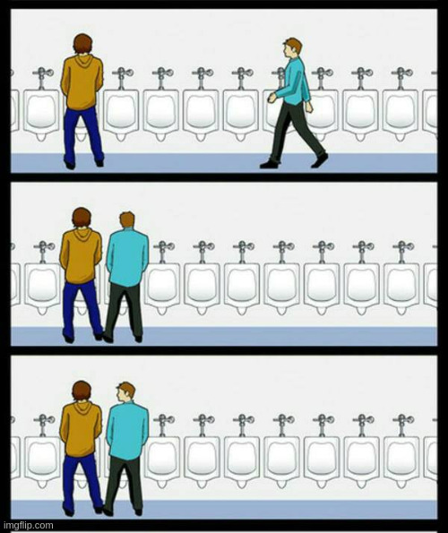
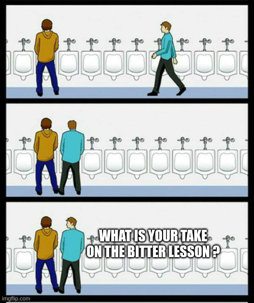
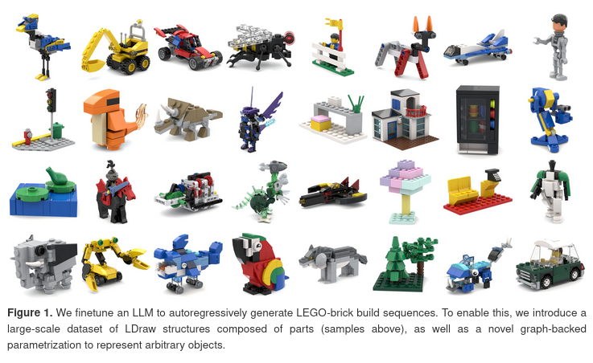
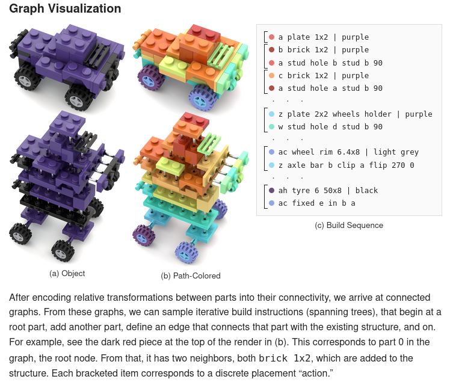
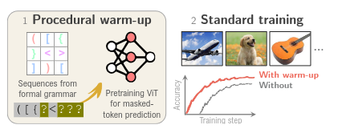

## Conferences before

## Conferences before

## Solution:
### Workshop on bitter lessons!

- Three sessions with three speakers talking about the bitter lesson (and more broadly the AI "explosion") + panel discussions

- Jon Barron: "3D = bitter lessonned?"

- Vincent Sitzmann: "3D (and more broadly mid-level vision) is useless"

- Bharath Hahirahan: "Mid level vision is useful"

## Is 3D useful?

Two contradictory signals:

- Workshop on bitter lessons: avoid 3D when you don't need it *explicitely*

- Last 3 best papers:
    - Dust3r (unofficial)
    - VGGT 
    - D4RT

- Small scale experiments on transfer learning for VGG-$\Omega$ (+ numerous papers on improving video generation using explicit 3D).

## Random takes {.smaller}

- 3D for vision might be dead, but vision for 3D is definitely alive [@Li2026ART; @Liu2026DeepFeature; @Xiao2026Universal3D].

- "3D is dead" &ne; "Geometry is dead" [@Chiang2026COTFM; @Luo2026FlowMatching]

- 2026: LLMs still don't improve the quality of orals or posters

- TRELLIS structured latent space enables numerous applications (tokenization[@dutt2026lost], editing[@Hu2026Easy3E], morphing[@Sun2026MorphAny3D], improving trellis[@Xia2026Pointsto] (again), ...)

- *Weak* signal that DinoV3 is not that better that DinoV2

## BrickNet: Graph-Backed Generative Brick Assembly

## BrickNet: Graph-Backed Generative Brick Assembly

## Can You Learn to See Without Images? Procedural Warm-Up for Vision Transformers

## Can You Learn to See Without Images? Procedural Warm-Up for Vision Transformers

