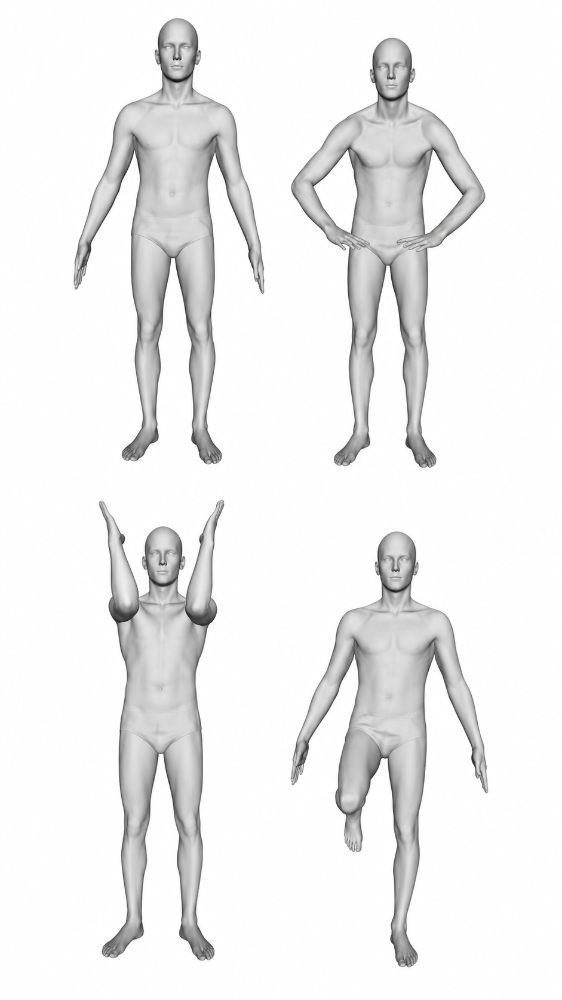
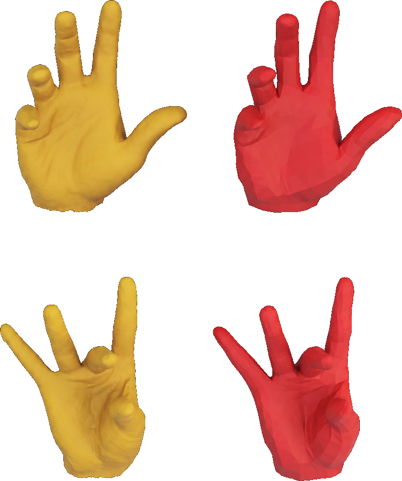
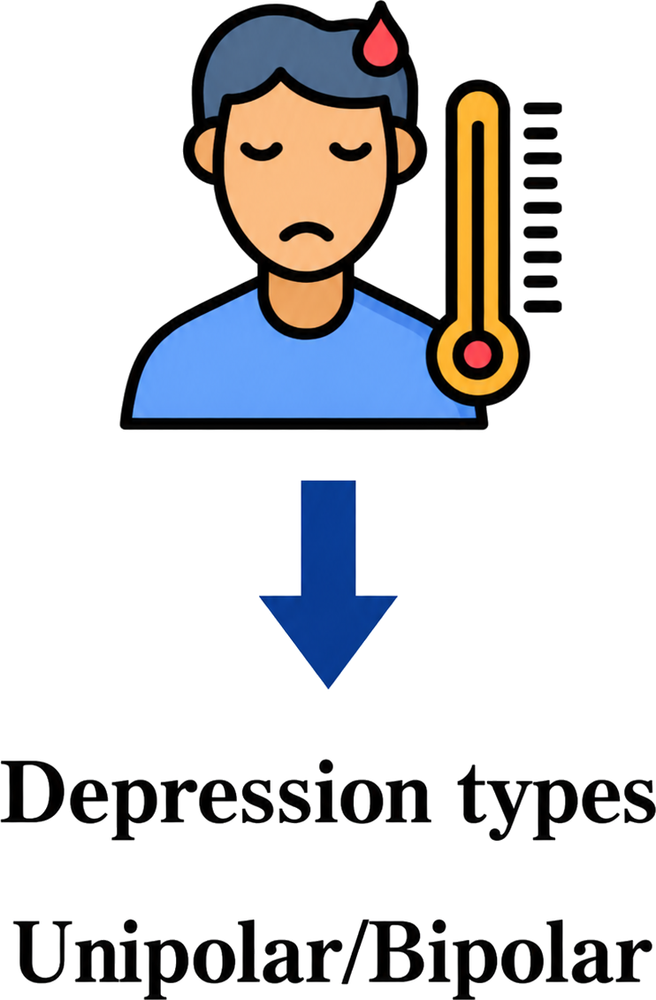
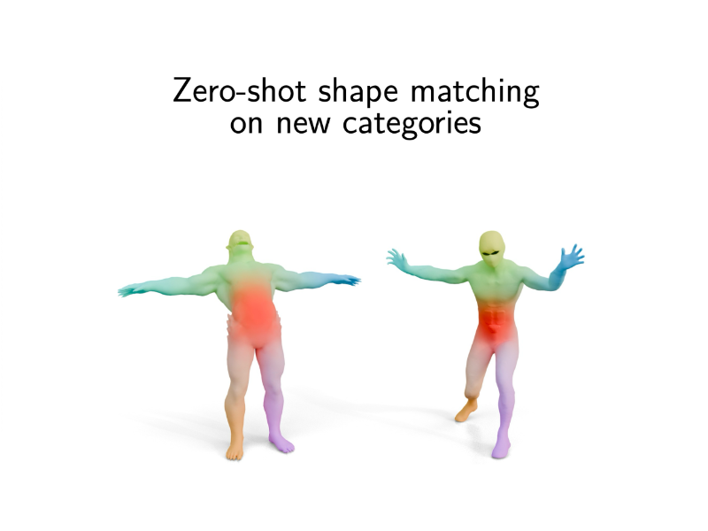
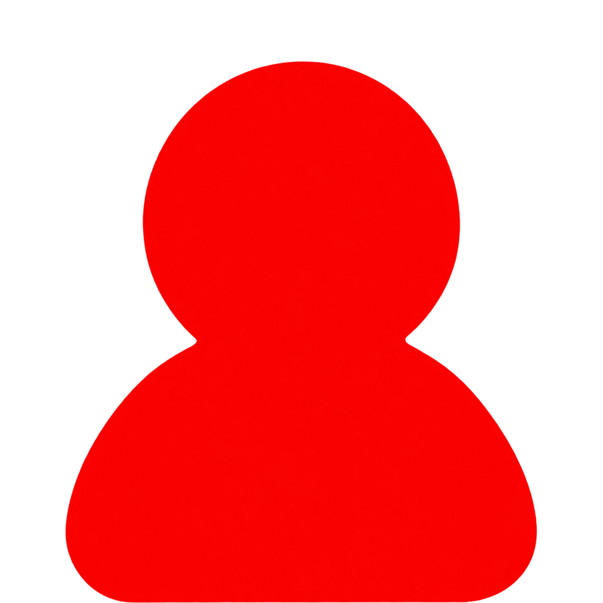
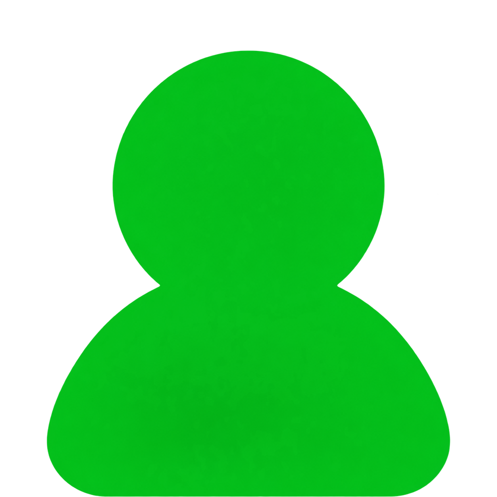
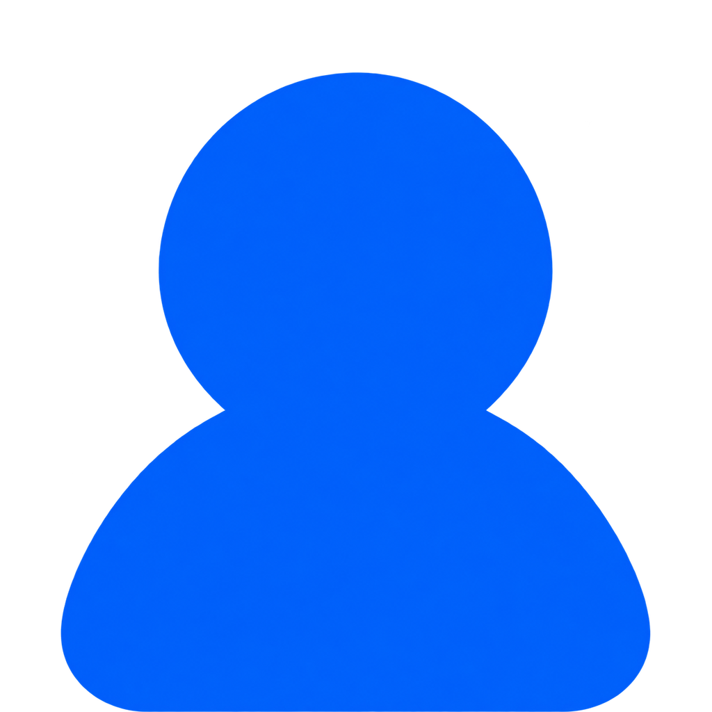
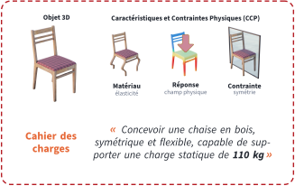
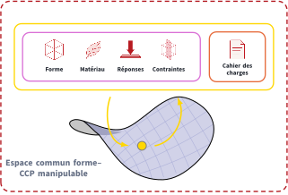
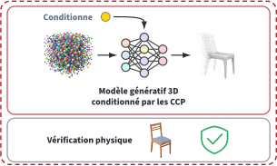

## À propos de moi

::: {.experience-layout}
::: {.experience-timeline}

Expériences de recherche

2020–2023<strong>Doctorat</strong><small>Université de Lille · CRIStAL · 3D-SAM</small>

Apr–Jul 2023<strong>Postdoc</strong><small>Université de Vienne · Département de Mathématiques</small>

Sep–Dec 2023<strong>Research Engineer</strong><small>CHU Lille · LilNCog · INTERACTIONS</small>

2024–2026<strong>Postdoc</strong><small>École Polytechnique · LIX · GeomeriX</small>

:::

::: {.experience-detail}

2020–2023 · DoctoratUniversité de Lille · CRIStAL · 3D-SAM · Pr. Mohamed Daoudi

<h3>Analyse de forme du corps humain: Comparaison et déformation</h3>

Objectifs

<ul>
<li>Construire des outils géométriques pour comparer des formes non rigides.</li>
<li>Modéliser les déformations du corps humains.</li>
<li>Relier géométrie et analyse de données anatomiques.</li>
</ul>

<strong>Expertise développée :</strong> Géométrie

<strong>Encadrements :</strong> Un stagiaire de M2

:::
:::

## À propos de moi

::: {.experience-layout}
::: {.experience-timeline}

Expériences de recherche

2020–2023<strong>Doctorat</strong><small>Université de Lille · CRIStAL · 3D-SAM</small>

Apr–Jul 2023<strong>Postdoc</strong><small>Université de Vienne · Département de Mathématiques</small>

Sep–Dec 2023<strong>Research Engineer</strong><small>CHU Lille · LilNCog · INTERACTIONS</small>

2024–2026<strong>Postdoc</strong><small>École Polytechnique · LIX · GeomeriX</small>

:::

::: {.experience-detail}

April–July 2023 · PostdocUniversité de Vienne · Département de Mathématiques · Pr. Martin Bauer

<h3>Analyser de formes (non rigides) non paramétrées</h3>

Objectifs

<ul>
<li>Étudier des formes indépendants de leur paramétrisation (discrétisation).</li>
<li>Construire des architectures adaptées à cette problèmatiques.</li>
<li>Développer des méthodes pour déformer des formes non rigides.</li>
</ul>

<strong>Expertise développée :</strong> Geometric deep learning

:::
:::

## À propos de moi

::: {.experience-layout}
::: {.experience-timeline}

Expériences de recherche

2020–2023<strong>Doctorat</strong><small>Université de Lille · CRIStAL · 3D-SAM</small>

Apr–Jul 2023<strong>Postdoc</strong><small>Université de Vienne · Département de Mathématiques</small>

Sep–Dec 2023<strong>Research Engineer</strong><small>CHU Lille · LilNCog · INTERACTIONS</small>

2024–2026<strong>Postdoc</strong><small>École Polytechnique · LIX · GeomeriX</small>

:::

::: {.experience-detail}

September–December 2023 · Research EngineerCHU Lille · LilNCog · INTERACTIONS · Pr. Ali Amad

<h3>CALYPSO: Clinique et AnaLYses PSychiatriques Objectives pour la dépression</h3>

Objectifs

<ul>
<li>Collecter une base de données objectives de patient dépressifs.</li>
<li>Transformer ces observations en marqueurs quantifiables de la dépression.</li>
<li>Corréler ces nouveaux marqueurs avec les réponses aux traitements.</li>
</ul>

<strong>Expertise développée :</strong> Modèles interprétables

<strong>Encadrements :</strong> Un stagiaire de M2

:::
:::

## À propos de moi

::: {.experience-layout}
::: {.experience-timeline}

Expériences de recherche

2020–2023<strong>Doctorat</strong><small>Université de Lille · CRIStAL · 3D-SAM</small>

Apr–Jul 2023<strong>Postdoc</strong><small>Université de Vienne · Département de Mathématiques</small>

Sep–Dec 2023<strong>Research Engineer</strong><small>CHU Lille · LilNCog · INTERACTIONS</small>

2024–2026<strong>Postdoc</strong><small>École Polytechnique · LIX · GeomeriX</small>

:::

::: {.experience-detail}

2024–2026 · PostdocÉcole Polytechnique · LIX · GeomeriX · Pr. Maks Ovsjanikov

<h3>Modèles génératifs géométriques</h3>

Objectifs

<ul>
<li>Entraîner des modèles génératifs généralistes pour les formes non-rigides.</li>
<li>Comprendre le fonctionnement des modèles génératifs en utilisant la géométrie.</li>
<li>Inverser et manipuler les modèles génératifs 3D.</li>
</ul>

<strong>Expertise développée :</strong> Modèles génératifs géométriques

<strong>Encadrements :</strong> Un stagiaire de M2, 2 doctorants (occasionnel)

:::
:::

## À propos de moi

::: {.experience-layout}
::: {.experience-timeline}

Expériences de recherche

2020–2023<strong>Doctorat</strong><small>Université de Lille · CRIStAL · 3D-SAM</small>

Apr–Jul 2023<strong>Postdoc</strong><small>Université de Vienne · Département de Mathématiques</small>

Sep–Dec 2023<strong>Research Engineer</strong><small>CHU Lille · LilNCog · INTERACTIONS</small>

2024–2026<strong>Postdoc</strong><small>École Polytechnique · LIX · GeomeriX</small>

:::

::: {.experience-detail .summary-detail}
<h3>Synthèse</h3>

<h4>Expertise</h4>

Géométrie · Géométric deep learning · Modèles interprétables · Modèles génératifs géométriques

<h4>Encadrements</h4>

3 stagiaires de M2 · 2 doctorants (occasionnel)

<h4>Publications</h4>

<strong>12</strong>conférences internationales (8 A*)

<strong>6</strong>venues internationales (4 journaux)

<strong>19</strong>Total (1 preprint)

:::
:::

## Contexte

<video class="context-video" autoplay loop muted playsinline>
<source src="images/demo_3dgen.mp4" type="video/mp4">
</video>

## Modèles génératifs 3D

::: {.gen3d-slide}
<ul class="gen3d-pros-cons">
<li class="positive fragment" data-fragment-index="1">+Réalisme</li>
<li class="positive fragment" data-fragment-index="2">+Fidélité visuelle</li>
<li class="negative fragment" data-fragment-index="3">−Optimisation purement visuelle</li>
<li class="negative fragment" data-fragment-index="4">−Pas de contrôle physique</li>
</ul>

Comment permettre un conditionnement physique de ces modèles génératifs&nbsp;?

<h3 class="fragment" data-fragment-index="6">État de l’art</h3>

<h4>Transfert fondation 3D</h4>

+ Pallie la rareté

− Représentation mixte

<small class="state-art-ref">Wimmer et al. <em>Back to 3D: Few-shot 3D keypoint detection with back-projected 2D features</em></small>

<h4>Structures de contrôle</h4>

+ Contrôle bien établi

− Généralisation limitée

<small class="state-art-ref">Mo et al. <em>StructureNet: Hierarchical graph networks for 3D shape generation</em></small>

<h4>Guidage par simulation physique</h4>

+ Signal physique réel

− Objets prédéfinis

<small class="state-art-ref">You et al. <em>PhysGen: Physically grounded 3D shape generation for industrial design</em></small>

:::

## Modèles génératifs 3D

::: {.gen3d-slide}
<ul class="gen3d-pros-cons">
<li class="positive">+Réalisme</li>
<li class="positive">+Fidélité visuelle</li>
<li class="negative">−Optimisation purement visuelle</li>
<li class="negative">−Pas de contrôle physique</li>
</ul>

Comment permettre un conditionnement physique de ces modèles génératifs&nbsp;?

<strong>CoPhi est un projet pour une période de 3 ans</strong>, au sein du service DIASI et du service SIALV (laboratoire LVA), cherchant à valider l’hypothèse suivante :

<blockquote>« une représentation commune et structurée des formes et des CCP permettra de dépasser les approches actuelles et d’améliorer le réalisme physique des méthodes génératives 3D. »</blockquote>

CCP : caractéristiques et contraintes physiques (CCP)

:::

## CoPhi: Conditionnement Physique de la génération 3D

::: {.project-intro}

CoPhi vise une génération 3D <strong>physique, réaliste et généraliste</strong> : à partir d’une consigne ou d’un cahier des charges, produire un objet dont les propriétés peuvent être vérifiées.

CoPhi s’organisera en 3 lots :

<strong>LOT 1</strong>Données physiques et benchmark multi-fidélité

<strong>LOT 2</strong>Représentation commune des formes et des CCP

<strong>LOT 3</strong>Génération 3D conditionnée par les CCP

 porteur du projet doctorant stagiaire

:::

## LOT 1 : Données physiques

::: {.lot1-focus-slide}

<strong>Verrou scientifique et objectif.</strong> 
<em>Les données communes formes 3D et CCP sont rares. L’objectif est de constituer le socle expérimental nécessaire à CoPhi.</em>

<h3>Objectifs</h3>
<ul>
<li>Constituer un corpus formes–CCP de grande échelle.</li>
<li>Produire un jeu de référence expert et multi-fidélité.</li>
<li>Définir le pipeline reproductible et le protocole d’évaluation.</li>
</ul>

:::

## LOT 2 : Représentation commune

::: {.lot1-focus-slide .lot2-focus-slide}

<strong>Verrou scientifique et objectif.</strong> 
<em>Les CCP regroupent des informations hétérogènes que les représentations 3D actuelles ne permettent pas d’exprimer. L’objectif est de donner une représentation commune à l’objet et son cahier des charges.</em>

<h3>Objectifs</h3>
<ul>
<li>Représenter conjointement formes et CCP.</li>
<li>Modifier et optimiser les propriétés physiques dans l’espace latent.</li>
<li>Aligner la représentation avec les cahiers des charges textuels.</li>
</ul>

:::

## LOT 3 : Génération 3D physique

::: {.lot1-focus-slide .lot3-focus-slide}

<strong>Verrou scientifique et objectif.</strong> 
<em>La génération 3D actuelle ne peut suivre un cahier des charges physique. Nous conditionnerons un modèle génératif en utilisant notre représentation commune.</em>

<h3>Objectifs</h3>
<ul>
<li>Adapter un modèle génératif 3D pré-entraîné.</li>
<li>Conditionner la génération par les CCP.</li>
<li>Évaluer le réalisme physique, la qualité et la diversité des objets générés.</li>
</ul>

:::

## Programme et équipements prioritaires de recherche (PEPR) IA

::: {.pepr-slide}

<strong>IA de confiance et IA distribuée</strong>

<strong>IA frugale et IA embarquée</strong>

<strong>Nouveaux fondements mathématiques de l’IA</strong>

:::

## Programme et équipements prioritaires de recherche (PEPR) IA

::: {.pepr-slide}

<strong>IA de confiance et IA distribuée</strong>

<strong>IA frugale et IA embarquée</strong>

<strong>Nouveaux fondements mathématiques de l’IA</strong>

:::

## IA frugale

::: {.pepr-followup}

Projets :

<strong>SHARP</strong> - Principes théoriques et algorithmiques de l’apprentissage frugal

<strong>HOLIGRAIL</strong> - Approches holistiques pour des architectures plus efficaces pour l’inférence et l’apprentissage

CoPhi privilégiera l’<strong>adaptation de modèles préentraînés</strong> afin de réduire conjointement les besoins en données et en calcul de l’apprentissage. Ces travaux renforceront les collaborations du CEA List sur ces deux projets.

:::

## IA de confiance

::: {.pepr-followup}

Projet :

Géné-Pi - <strong>Mathématiques des modèles génératifs</strong>

CoPhi rendra les modèles génératifs <strong> plus contrôlables</strong> et leurs <strong>performances quantifiables</strong>. CoPhi ouvrira ainsi une nouvelle voie d’implication du CEA dans le PEPR IA autour de Géné-Pi.

:::

## Contexte scientifique

::: {.scientific-context}

<h3>LVA</h3>

Génération de formes 3D, conditionnement spatial et physique des contenus visuels.

<h3>LASTI</h3>

Modèles génératifs visuels, contrôle et explicabilité des modèles génératifs.

<h3>LSI</h3>

Apprentissage pour la simulation mécanique et modèles monde pour la robotique.

<strong>Genφ</strong>Génération 3D physique consciente

CoPhi développera des synergies naturelles avec Genφ. De plus, il s’intégrera dans un environnement de collaborations déjà établies entre le LVA, le LASTI et le LSI.

:::

## Conclusion

::: {.conclusion-slide}
<ul>
<li class="fragment" data-fragment-index="1"><strong>Contexte :</strong> essor rapide des modèles génératifs 3D.</li>
<li class="fragment" data-fragment-index="2"><strong>Problème :</strong> absence de contrôle des propriétés physiques.</li>
<li class="fragment" data-fragment-index="3"><strong>Approche :</strong> une représentation commune formes–CCP pour conditionner la génération.</li>
<li class="fragment" data-fragment-index="4"><strong>Trois lots :</strong> Données, Représentation commune, Modèle conditionné.</li>
<li class="fragment" data-fragment-index="5"><strong>Positionnement :</strong> un contexte scientifique adapté au sein du CEA et dans le cadre du PEPR IA.</li>
</ul>
:::
